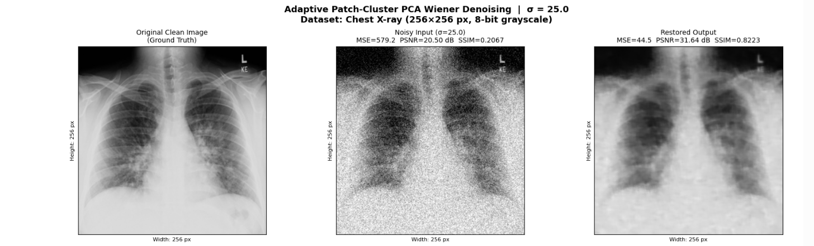
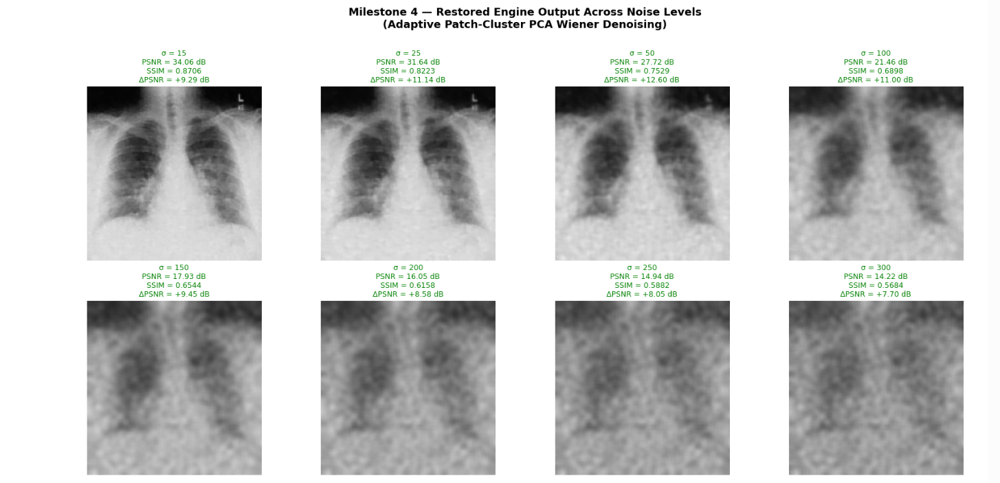
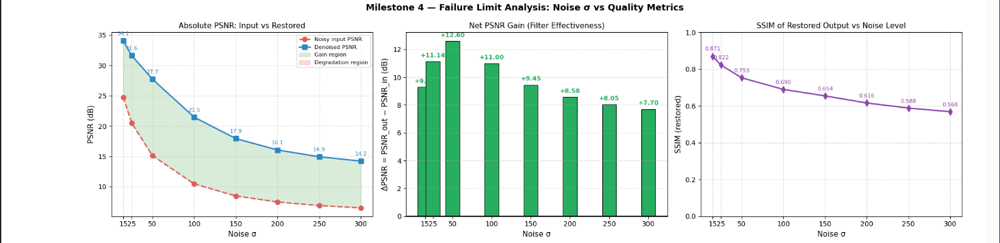

# Adaptive Patch Clustering with Suboptimal Wiener Filter in PCA Domain

An image denoising implementation combining adaptive patch clustering with a suboptimal Wiener filter applied in the Principal Component Analysis (PCA) domain, evaluated across multiple noise types.

## 🎯 Project Overview

Image degradation from noise introduced during acquisition is a long-standing problem in image processing. This project implements and validates a denoising pipeline where image patches are **adaptively clustered** and then denoised using a **suboptimal Wiener filter** operating in the **PCA-transformed domain** — exploiting the fact that principal components tend to capture scene structure, while trailing components mainly capture noise.

The approach is evaluated on grayscale images corrupted by four distinct noise types:
- **Gaussian noise**
- **Salt & pepper noise**
- **Speckle noise**
- **Poisson noise**

## 🧪 Methodology

1. **Noise corruption** — a clean grayscale image is corrupted using each of the four noise models in turn.
2. **Adaptive patch clustering** — overlapping image patches are grouped into clusters based on structural similarity, allowing patches with similar local content to be denoised together.
3. **PCA transform** — each cluster of patches is projected into its own PCA basis, concentrating signal energy into the leading components.
4. **Suboptimal Wiener filtering** — a Wiener filter is applied in the PCA domain to suppress noise-dominated coefficients while preserving signal-carrying components.
5. **Reconstruction** — denoised patches are transformed back and aggregated into the final restored image.

## 📊 Evaluation

Denoising performance is quantified using standard image quality metrics, typically including:
- **PSNR** (Peak Signal-to-Noise Ratio)
- **SSIM** (Structural Similarity Index)
- Additional perceptual/quality metrics as applicable

Each noise type is evaluated separately to give a comprehensive picture of how the method performs under different corruption conditions.

## 📁 Repository Structure

```
.
├── (denoising implementation notebook/script)
├── (sample/test images)
└── README.md
```

*(Update this section with your actual file names once finalized — see naming suggestions below.)*

## 🚀 Running the Project

```
pip install numpy scipy scikit-image matplotlib opencv-python
# then run the notebook or script, e.g.:
jupyter notebook <notebook_name>.ipynb
```

## 📈 Results

## 📈 Results

Evaluated on a 256×256 8-bit grayscale chest X-ray image corrupted with additive Gaussian noise. Patches were extracted (8×8 → 64D), clustered via K-Means (K=8), and denoised with a suboptimal Wiener filter in the PCA domain.

**Main result (σ = 25.0):**

| Metric    | Noisy Input | Denoised Output | Improvement |
|-----------|-------------|------------------|-------------|
| MSE       | 579.17      | 44.55            | −534.62     |
| PSNR (dB) | 20.50       | 31.64            | +11.14      |
| SSIM      | 0.2067      | 0.8223           | +0.6157     |

**Robustness across noise levels (σ sweep, 15–300):**

| σ   | Noisy PSNR (dB) | Denoised PSNR (dB) | ΔPSNR  | Denoised SSIM |
|-----|------------------|----------------------|--------|----------------|
| 15  | 24.76            | 34.06                | +9.29  | 0.871          |
| 25  | 20.50            | 31.64                | +11.14 | 0.822          |
| 50  | 15.12            | 27.72                | +12.60 | 0.753          |
| 100 | 10.46            | 21.46                | +11.00 | 0.690          |
| 150 | 8.48             | 17.93                | +9.45  | 0.654          |
| 200 | 7.48             | 16.05                | +8.58  | 0.616          |
| 250 | 6.89             | 14.94                | +8.05  | 0.588          |
| 300 | 6.52             | 14.22                | +7.70  | 0.568          |

The filter delivers a consistent PSNR gain across the full tested range, with no hard failure point found up to σ = 300 — gains peak around σ = 50 (+12.6 dB) and taper gradually as noise increases.

**Before / After (σ = 25.0):**



**Across noise levels:**





## 📚 Reference

This implementation is based on the methodology described in:

Rane, S., Ragha, L., Biradar, S., & Pandit, V. (2022). Image Denoising using Adaptive Patch Clustering with Suboptimal Wiener Filter in PCA Domain. *International Journal of Engineering Trends and Technology (IJETT)*, 70(11), 19–27.

## 🎓 Context

Developed as part of coursework/research within a Data Science MS program (IMSciences, Peshawar), focused on image processing and denoising techniques.

## 📄 License

Educational/academic use.
